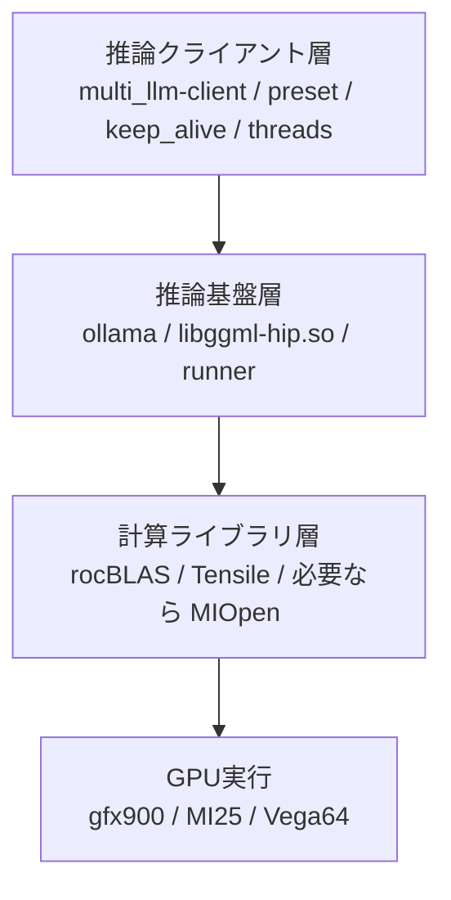
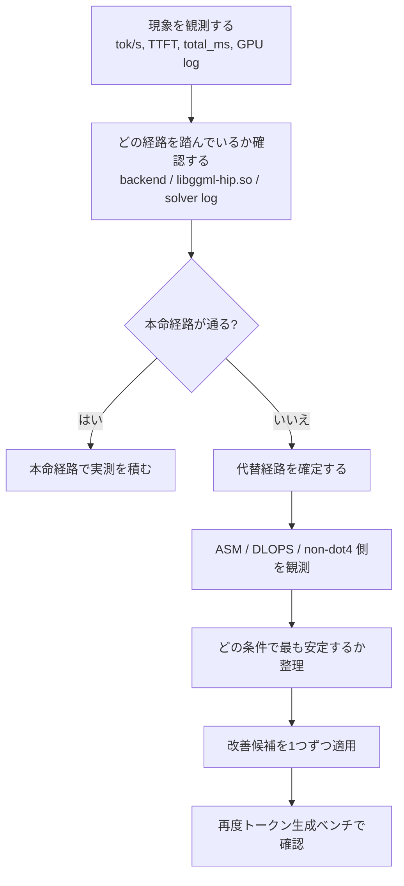

# Vega最適化戦略メモ

## 0. この文書の目的

この文書は、Vega 世代 GPU（主に MI25 / Vega64）に対して、**どこを触れば現実的に改善余地があるのか**を整理するための戦略メモです。

ここでいう「最適化」は、魔法のように新しい AI 専用回路を生やすことではありません。むしろ逆で、**いま残っている経路を丁寧に見つけて、使える道を太くする**という発想です。

言い換えると、この計画は

* 存在しない機能を無理やり復活させること
* upstream が意図的に切った危険な道を強引に通すこと

ではなく、

* すでに残っている fallback / 代替 solver / 非 dot4 実装
* gfx900 でまだ到達可能な solver 選択
* 実機で再現できる安全な経路

を見つけて、**どこなら“拾える”かを明らかにすること**を目指します。

---

## 1. いま起きていることをすごくやさしく言うと

Vega 世代では、現代の AI 向けに最適化された「いちばん速い本命ルート」が、そのままでは使えないことがあります。

でも、それは必ずしも「そこで終わり」という意味ではありません。
多くの場合は、

1. ある solver や実装候補が試される
2. gfx900 では条件に合わず弾かれる
3. そのあと別の候補が選ばれる

という流れになります。

つまり、Vega 最適化の本質は、
**落ちた場所を嘆くことではなく、そのあと何が拾っているかを見ること**です。

たとえるとこうです。

* 高速道路に入りたい
* でも工事中で通れない
* そこで終わりではなく、一般道やバイパスに回る
* そのバイパスの中に、まだ十分走れる道がある

この「まだ十分走れる道」を見つけて整えるのが、今回の戦略です。

---

## 2. 戦略の基本姿勢

### 2.1 やらないこと

この計画では、次のような方向は主戦略にしません。

* MLIR iGEMM を無理やり resurrect する
* upstream が `gfx900` を明示除外している経路を強行突破する
* assertion や tuning parameter 不足を無視して通す

理由は単純で、これは「最適化」ではなく、**壊れた橋を無理に渡る行為**になりやすいからです。

### 2.2 やること

代わりに、次の方向を主戦略にします。

* solver 選択のどこで弾かれているか観測する
* 弾かれたあと、何が次候補として生きているか確かめる
* 非 dot4 実装や ASM / DLOPS 側の残存経路を使う
* 実機ログで fallback を確定し、比較可能な形で残す
* 実際にトークン生成へ効く改善だけを採用する

つまり、
**「無理筋の復活」ではなく「残存経路の整理と育成」**が中心です。

---

## 3. どこに改善余地がありそうか

改善余地は、大きく 3 層に分かれます。

### 3.1 推論クライアント層

ここは一見地味ですが、実際にはかなり重要です。

* preset の違い
* `NumThreads`
* `keep_alive`
* warm / cold 状態
* 同一プロンプトでの繰り返し測定

これらで結果がかなり変わります。

つまり、**GPU の差に見えたものが、実はクライアント設定差だった**ということが普通に起きます。

ここを揃えずに低レイヤーだけ見ても、「速くなった気がする」だけで終わりやすいです。

### 3.2 推論基盤層

ここでは、実際にどの backend が読み込まれ、どの `libggml-hip.so` が使われ、どのサービス構成で立ち上がっているかが効きます。

同じ `ollama` という名前でも、

* 起動パス
* service の環境変数
* 共有ライブラリ探索パス
* local fork か distro build か
* `librocblas.so.5` をどこから解決したか
* Tensile の `.dat/.hsaco` をどこから読むか

で、結果はかなり変わります。

ここは「同じバイナリなら同じ結果になる」と思いやすい場所ですが、実際には**同じバイナリ名でも周辺の土台が違えば別物**です。

特に現時点の実環境は、

* `librocblas.so.5` 本体は system ROCm 側から解決される
* 一方で Tensile の fallback 資産はローカル fork パスを使う

という、**system rocBLAS バイナリ + fork 側 Tensile 資産**の混在状態です。

したがって、今後「solver 優先順位を見直す」と言うときは、

* rocBLAS バイナリ本体に手を入れる話なのか
* Tensile カタログや kernel 資産の選択を詰める話なのか
* あるいはライブラリ探索順や `ROCBLAS_TENSILE_LIBPATH` を含むランタイム構成を触る話なのか

を分けて書く必要があります。

### 3.3 計算ライブラリ層

現行の tinyllama / ollama / GGML 系推論スタックで、いま第一に見るべきなのは **rocBLAS → Tensile** 側です。

理由は単純で、現時点の実機証跡では

* `libggml-hip.so`
* `librocblas.so.5`
* `TensileLibrary_*_fallback.dat/.hsaco`

へのアクセスは確認されている一方、**MIOpen ライブラリの openat は観測されていない**からです。

つまり、現行の LLM 推論クリティカルパスに関しては、少なくとも今の証拠では
**MIOpen より rocBLAS / Tensile が本命**です。

ただし、MIOpen の solver 研究それ自体に価値がないわけではありません。
それは主に

* 畳み込み系 workload
* 歴史的 fallback 構造の理解
* gfx900 で「どのように弾かれ、何へ落ちるか」の一般原理の理解

において意味があります。

したがって本メモでは、**LLM 推論の実務上の最優先は rocBLAS / Tensile、MIOpen は補助的・比較参照的な位置づけ**とします。

## 4. 現時点での重要な仮説

### 仮説A: gfx900 では「本命経路の復活」より「代替経路の強化」が本筋

これはかなり重要です。

gfx900 では、最新の AI 向けに使われる本命経路が、そもそも明示的に不適用とされている場所があります。
そのため、主戦略は

* その除外を無理やり外すこと

ではなく、

* 除外後に残る solver を理解すること
* その solver が本当に選ばれているか観測すること
* その代替ルートの中で一番マシなものを探すこと

になるはずです。

### 仮説B: MIOpen の solver 選択段は「拾いどころ」になりうる

この段階では、候補が列挙され、条件に合わないものが落ち、そのあと次候補へ進む構造があります。

つまり、ここは
**落ちたものをその後ろで拾う**
という戦略が最も自然に置ける場所です。

### 仮説C: rocBLAS / Tensile の non-dot4 側にも改善余地がある

gfx900 は dot4 capability で不利ですが、だからといって完全終了ではありません。

むしろ、

* dot4 非対応時の実装選択
* lazy loading の分岐
* 古い実装側へのフォールバック

がどのように働くかを詰めることで、まだ改善余地が残っている可能性があります。

---

## 5. どこが「拾える場所」か

### 5.1 第一候補: rocBLAS / Tensile の fallback・非 dot4 側

現行の LLM 推論スタックで最も有望なのは、まずここです。

理由は、実機証跡として

* `libggml-hip.so`
* `librocblas.so.5`
* `TensileLibrary_*_fallback.dat/.hsaco`

へのアクセスが確認されているからです。

特に、gfx900 では dot4 capability で不利ですが、だからといって完全終了ではありません。
むしろ、

* dot4 非対応時の実装選択
* lazy loading と catalog 解決
* fallback 資産の参照
* 古い実装側へのフォールバック

がどのように働くかを詰めることで、まだ改善余地が残っている可能性があります。

#### ここでやること

* dot4 不在時にどの実装が選ばれるか確認する
* lazy loading と catalog 解決を追う
* non-dot4 実装の実測性能を取る
* 問題サイズ別に、どこで失速するかを見る
* `Type_HH` など実際に読まれている fallback 資産の型を絞る

### 5.2 第二候補: MIOpen の solver 選択段

ここは、**現行 tinyllama 推論の主経路として最有力**という意味ではありません。

少なくとも今の実機証跡では、LLM 推論中に MIOpen ライブラリの openat は観測されていません。
したがって、MIOpen は現段階では

* LLM 推論の直接の本命経路

というより、

* gfx900 での fallback 設計の比較参照
* 畳み込み系 workload を含む周辺研究
* 「落ちたあと次候補で拾う」構造の理解

のための補助線として扱うほうが正確です。

ただし、構造としては

* 候補の列挙がある
* `IsApplicable` によるふるい落としがある
* 次候補へ進む構造がある

ため、「落ちたものをその後ろで拾う」という発想のモデルケースとしては依然有用です。

#### ここでやること

* MIOpen を LLM の主経路と誤認しない
* 必要なら別 workload で solver 選択を整理する
* gfx900 で安定して選ばれる solver を一覧化する
* “落ちやすい条件” と “拾われやすい条件” を切り分ける

### 5.3 第三候補: クライアント・運用設定の詰め

これは低レイヤーほどロマンはありませんが、効果が出やすいです。

#### ここでやること

* `safe` preset を基準として固定
* `balanced` は別線で運用最適化候補として扱う
* `NumThreads` の感度を見る
* `keep_alive` で warm/cold の差を外す
* steady-state を基準に比較する

ここは「部品交換」ではなく、**セッティング出し**に近いです。

## 6. やらないほうがよさそうな場所

### MLIR iGEMM を無理やり通す

これは現時点では主戦略にしないほうがよさそうです。

理由は、

* gfx900 が意図的に除外されている
* tuning parameter / Perf DB が揃っていないと危険
* 強行すると assertion や crash に繋がる証跡がある

からです。

これは「まだ舗装されている裏道」ではなく、**通行止めの橋**に近いです。

戦略としては、

* 通行止めの橋を再建する

より、

* まだ通れるバイパスを見つけて整備する

ほうが、はるかに現実的です。

---

## 7. 戦略全体の流れ

この流れで大切なのは、**必ず最後にトークン生成へ戻ること**です。

低レイヤーで「速くなったように見える」だけでは足りません。
最終的に欲しいのは、

* TTFT が良くなったか
* total_ms が短くなったか
* tok/s が上がったか
* 安定動作するか

です。

だから、低レイヤー最適化は必ず**推論ベンチへ戻して確認**する必要があります。

---

## 8. 実行順の提案

### Phase 1: 観測の固定

まずは比較土台を固定します。

* preset は `gfx900_safe` を基準固定
* `NumThreads` と `keep_alive` を明示
* 同一プロンプト・同一モデル・複数回反復
* `ttft_ms`, `total_ms`, `tok/s` を JSONL に保存

この段階は、現時点では**実質完了に近い**です。
今後はここを動かすより、基準条件として維持するほうが重要です。

### Phase 2: fallback の確定

次に、`fallback_confirmed` を現行実機で最低1件は確定します。

* solver 選択ログを取る
* どこで弾かれたかを見る
* そのあと何が採用されたかを残す
* あるいは runtime の fallback 資産アクセスを証跡として残す

ここは戦略全体の中核です。

### Phase 3: 代替経路の地図づくり

* rocBLAS / Tensile fallback 資産
* non-dot4 側
* 必要なら比較参照としての MIOpen solver

のうち、どれがどんな条件で選ばれるかを整理します。

ここで大事なのは、**catalog が読まれたこと**と**その kernel が実際に dispatch されたこと**は区別して扱うことです。
現時点の `fallback_confirmed` は前者の runtime 証跡として有効ですが、後者はまだ今後の切り分け対象です。

### Phase 4: 小さな改善を一つずつ適用

* Tensile 資産の型・問題サイズ対応の整理
* ランタイム構成や探索順の確認
* thread 感度の確認
* warm/cold の差分除去

ここで言う改善候補は、**system rocBLAS バイナリ本体の改変**とは限りません。
むしろ現状では、

* fork 側 Tensile 資産
* ライブラリ探索順
* ランタイム設定

の影響も大きいため、混在前提で整理する必要があります。

### Phase 5: かならず推論へ戻す

最後に、tinyllama などで実際のトークン生成を測り直します。

## 9. 戦略のやさしい要約

この計画は、

**「Vegaで使えない最先端機能を無理やり復活させる話」ではありません。**

そうではなく、

**「Vegaでまだ使える道を見つけて、その中で一番まともな道を太くする話」**
です。

たとえるなら、

* 閉鎖された最新高速道路を無理に開通させるのではなく
* まだ走れるバイパスや一般道を見つけて整備する

という発想です。

そして、その”まだ走れる道”として有望なのが、

* rocBLAS / Tensile の non-dot4 側（現行 LLM 推論スタックでの第一候補）
* MIOpen の solver 選択段（補助線・比較参照）
* クライアント層のセッティング

だと考えています。

---

## 10. 現時点の結論

現時点で最も妥当な戦略は、次の一文にまとまります。

> **Vega 最適化の本筋は、意図的に切られた本命経路の復活ではなく、既存の fallback / 代替 solver / 非 dot4 経路を観測・確定し、その中で最も安定して実利のある経路を育てることにある。**

ただし、現行の tinyllama / ollama / GGML 系 LLM 推論スタックに限れば、
**第一に見るべきは rocBLAS / Tensile 側**です。
MIOpen は現時点では主経路の実証拠がないため、補助的・比較参照的な位置づけにとどめます。

また、`fallback_confirmed` の意味も厳密に分けて扱います。
現時点で確認できたのは、**runtime が fallback 資産へ実アクセスしたこと**です。
これは gate 判定としては有効ですが、**個々の GEMM 呼び出しで fallback kernel が実際に dispatch されたこと**までを、まだ単独で証明したわけではありません。

この方針なら、

* 実機で再現できる
* 実践者が理解できる
* 比較可能な形で改善できる
* 無理筋のパッチに依存しすぎない

という意味で、長く使える戦略になります。

---

## 11. 2026-03-24 時点の進捗と残務

### 11.1 進捗（確定）

* `safe` 固定方針は維持（研究基準 preset）
* `fallback_confirmed` は runtime 証跡で達成済み
  * `g4_summary_tinyllama_latest_20260324_005717.txt`
  * `fallback_dat_openat=54`, `fallback_hsaco_openat=54`
* クライアント層の比較自動化を追加
  * `multi_llm-client` に one-shot CLI（`--prompt` など）
  * `multi_llm-client/scripts/phase3_bench.sh` で preset/thread/keep_alive sweep を反復可能化
* Phase3 初回一括測定（`all x3`）を実施し、`vega_optimize-statistics.md` に反映
* n=10 反復測定を追加実施
  * `tinyllama`: `num_thread=2/4/6`、`keep_alive=0s/10m`
  * `qwen2.5:7b`: `keep_alive=0s/10m`
* 追加反復を実施
  * `tinyllama`: preset sweep（`safe/balanced/longctx`）n=10
  * `tinyllama`: `num_thread=4/6` 長時間（n=20）
  * `qwen2.5:7b`: `num_thread=4/6`（n=10）
  * クロスモデル既定値: `safe + keep_alive=10m + num_thread=4`
  * tinyllama 吞吐特化のみ `num_thread=6` を別プロファイル化
* fallback 型別集計を追加
  * `summarize-fallback-types.sh` で `Type_*` の `dat/hsaco` 読み込み内訳を固定
  * ただし dispatch 直接証跡は未確定

### 11.2 残務（技術）

* catalog read と dispatch を分離して証跡化する
  * 目的: `fallback` 資産アクセスだけでなく、呼び出し時にどの型・実装が選ばれたかを絞る
* catalog read と dispatch の境界を切り分ける追加証跡（GEMM 呼び出し粒度）
* `balanced` 適用時の VRAM/安定性（長時間 run）を追加確認
* 長文プロンプト条件で `safe` と `balanced` の逆転有無を確認

### 11.3 残務（運用）

* 外部投稿（AMD Community / Discord / forum）への最終反映
* 公開リンクを導線ドキュメントへ確定反映
